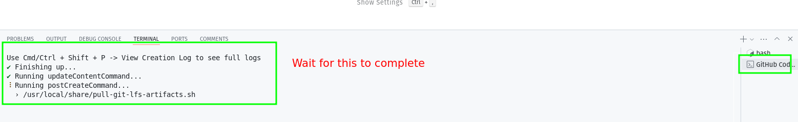
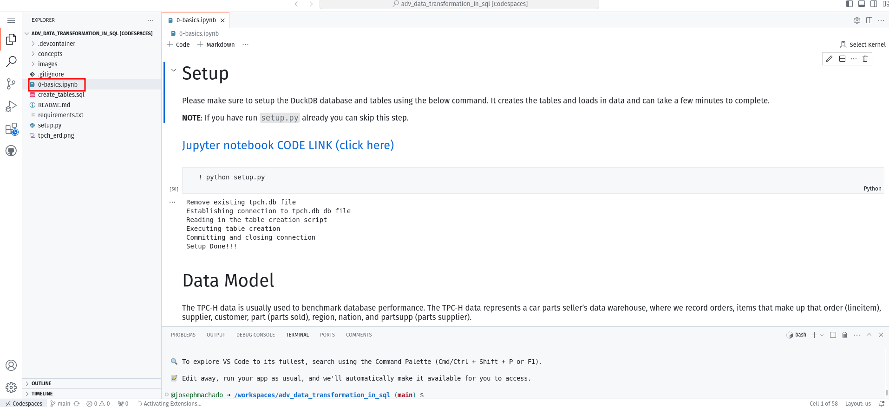
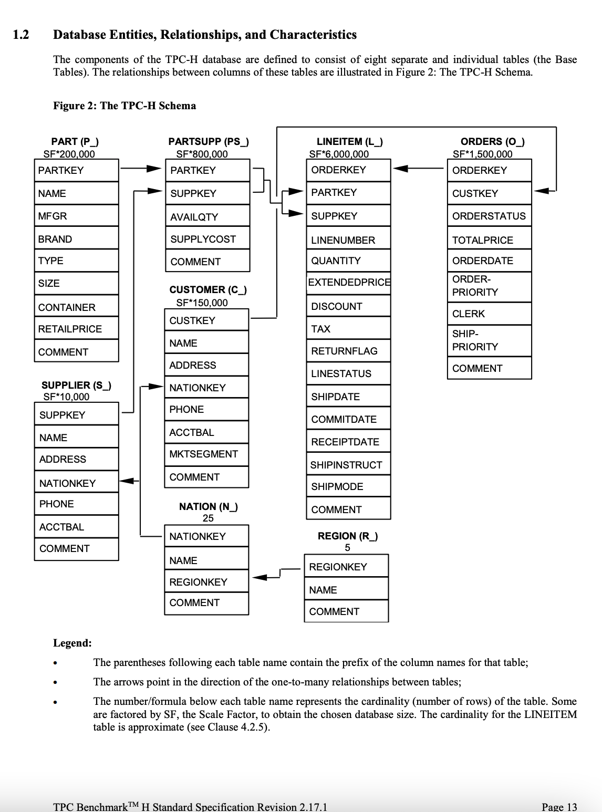

* [Advanced Data Transformation in SQL Workshop](#advanced-data-transformation-in-sql-workshop)
    * [Live virtual workshop](#live-virtual-workshop)
    * [Prerequisites](#prerequisites)
    * [Setup](#setup)
        * [Option 1: Github codespaces (Recommended)](#option-1-github-codespaces-recommended)
        * [Option 2: Run locally](#option-2-run-locally)
    * [Data Model](#data-model)
    * [Topics covered in the workshop](#topics-covered-in-the-workshop)
    * [Feedback](#feedback)

# Advanced Data Transformation in SQL Workshop

If you like this workshop, you'd love my [Practical Hands on Data Engineering Workshop](https://astounding-architect-5764.ck.page/684e1f422f).

## Live virtual workshop

The workshop will be streamed on YouTube live: [Advanced Data Processing in SQL YouTub Live](https://youtube.com/live/fB4XHC6ZaCs). Post stream, it will be available to watch and follow at your own pace.

**How to use nested data types in SQL, YouTube Link**
[](https://www.youtube.com/live/pf2myqLDgPg)

## Prerequisites

1. Sign up for a Github account.
2. Go through the [Setup](#setup) process and complete the **[0-basics](./0-basics.ipynb)** notebook exercises.

## Setup

You have two options to run the exercises in this repo

### Option 1: Github codespaces (Recommended)

Steps:

1. Create [Github codespaces with this link](https://github.com/codespaces/new?skip_quickstart=true&machine=basicLinux32gb&repo=833339774&ref=main&geo=UsEast).
2. Wait for Github to install the [requirements.txt](./requirements.txt). This step can take about 5minutes.
        
3. In the terminal run `python setup.py` to create the tables and data necessary for the exercises.
4. Now open the `0-basics.ipynb` (or any ipynb) and it will open in a Jupyter notebook interface. You will be asked for your kernel choice, choose `Python Environments` and then `python3.10.13 Global`.
        
5. Complete the **[0-basics](./0-basics.ipynb)** notebook as prerequisite.

### Option 2: Run locally

Steps:

1. Clone this repo, cd into the cloned repo
2. Start a virtual env and install requirements.
3. In the terminal run `python setup.py` to create the tables and data necessary for the exercises.
4. Start Jupyter lab and run the `ipynb` notebooks.
5. Complete the **[0-basics](./0-basics.ipynb)** notebook as prerequisite.

```bash
git clone https://github.com/josephmachado/adv_data_transformation_in_sql.git
cd adv_data_transformation_in_sql
python -m venv ./env # create a virtual env
source env/bin/activate # use virtual environment
pip install -r requirements.txt
python setup.py
jupyter lab
```

## Data Model

The TPC-H data represents a car parts seller’s data warehouse, where we record orders, items that make up that order (lineitem), supplier, customer, part (parts sold), region, nation, and partsupp (parts supplier). 

Note: Have a copy of the data model as you follow along; this will help in understanding the examples provided and in answering exercise questions.



## Topics covered in the workshop

1. [Window functions](./concepts/windows/)
2. [CTEs](./concepts/CTE/)
3. [Common query templates for common data processing problems](./concepts/query_templates/)
4. [Nested data types](./concepts/nested_data_types/)

## Feedback

I'd love to hear any feedback, please send them **[by clicking here](https://jrir55dxz0v.typeform.com/to/FH21xsvY)**.
